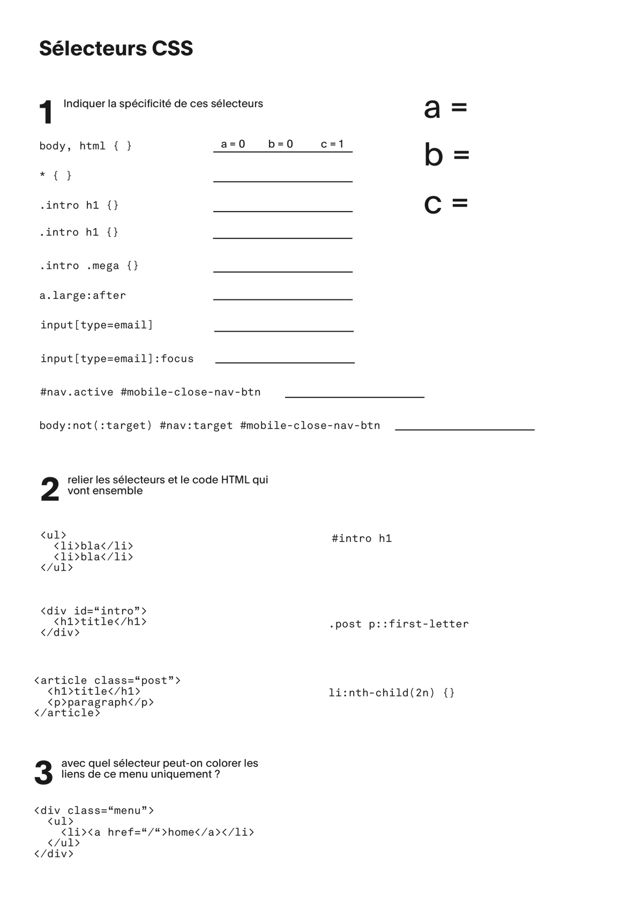

Les cours du 6 et 13 mai portent sur les **sélecteurs CSS**.

Méthode: travailler sur des sujets précis, que vous devrez communiquer au reste de la classe.

Sujets attribués :

| Matière    | Groupe expert |
|:------- |:----------------- |
| **Sélecteurs Niveau 1** | Vitor, Gabriela, Maxime, Sebastian, Dorian      |
| **Sélecteurs Niveau 2** | Kélian, Anaïs, Dorian, Tania  |
| **Sélecteurs Niveau 3** | Titouan, Audrey      |
| **Specificité** | Samy, Rackel      |

Sur les selecteurs level 1 à 3, vous trouverez des indications ici: [Cours Unités CSS](https://cours-web.ch/css/units.html)

Sur la spécificité: [Spécificité CSS](https://cours-web.ch/css/specificite.html)

Le [document Figma](https://www.figma.com/file/wC9KWXYMjmjng1pA0Ns2hH/CSS-Selectors-ID402): 

<iframe style="border: 1px solid rgba(0, 0, 0, 0.1);" width="100%" height="450" src="https://www.figma.com/embed?embed_host=share&url=https%3A%2F%2Fwww.figma.com%2Ffile%2FwC9KWXYMjmjng1pA0Ns2hH%2FCSS-Selectors-(ID402)%3Fnode-id%3D0%253A1" allowfullscreen></iframe>

Le 13 mai, [une fiche-exercice (PDF)](img/selecteurs/selecteurs-css-questions.pdf) est distribuée et réalisée individuellement.

Dans la deuxième partie de la leçon: nous revenons à la réalisation de sites. Chaque élève s'attribue une "Issue" d'un autre élève afin de progresser vers la finition du site.

